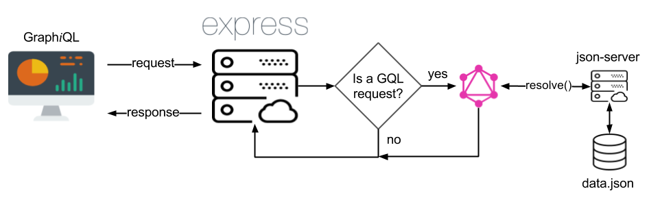

## Recursos necesarios

Para el desarrollo de la charla/taller, se recomienda que dispongas de las siguientes herramientas en el equipo informático donde vayas a trabajar:

- Gestor de versiones [Git](https://git-scm.com/), versión 2.7 o superior.
- [NodeJS](https://nodejs.org/es/download/current/), versión 7.0 o superior.
- Navegador web [Google Chrome](https://www.google.es/chrome/browser/desktop/index.html), versión 58.0 o superior.
- Editor de código [Visual Studio Code](https://code.visualstudio.com/), versión 1.13 o superior, con las siguientes extensiones instaladas:
    - [ESLint](https://marketplace.visualstudio.com/items?itemName=dbaeumer.vscode-eslint).
    - [GraphQL for VSCode](https://marketplace.visualstudio.com/items?itemName=kumar-harsh.graphql-for-vscode).
    - [npm Intellisense](https://marketplace.visualstudio.com/items?itemName=christian-kohler.npm-intellisense).

## Introducción

Este repositorio contiene el código necesario para llevar a cabo un taller introductorio a GrpahQL desde el lado del servidor.

El objetivo de dicho código será crear una aplicación en NodeJS con la cual, podremos registrar películas, directores, guionistas, géneros cinematográficos así como actores y actrices, en un segundo servidor cuya única función será la de proveer datos. Dicho servidor estará basado en [json-server](https://github.com/typicode/json-server) y su estructura de datos sigue el sigueinte esquema relacional:


Una vez dicho esto, el diagrama de la infraestructura que vamos a emplear será el siguiente:



Si no entiendes alguno de los elementos mostrados en el esquema, por favor, no te preocupes, los abordaremos durante el taller.

## Configuración del entorno

Una vez expuesto lo que vamos a hacer en el taller, es hora de configurar el entorno de trabajo.

#### Servidor de datos

Lo primero es descargar el servidor que contiene los datos de las películas que vamos a consumir desde GraphQL. Para ello, debes seguir estos pasos:

```sh
$ git clone https://github.com/ddialar/js.json-server.movies.git movies-server
$ cd movies-server
$ npm install
$ npm run json_server
```

Si quieres más información acerca de cómo funciona este servidor, te invito a que accedas a la [página de inicio](https://github.com/ddialar/js.json-server.movies.git#readme) del repositorio.

#### Servidor GraphQL

Este será el servidor cuyas funcionalidades iremos implementando durante el taller.

Para configurar el entorno, primero debes estar fuera del directorio donde tienes el servidor de películas y a continuación, debes seguir estos pasos:

```sh
$ git clone https://github.com/ddialar/graphql.server.workshop.git graphql-server
$ cd graphql-server
$ npm install
```

Si todo ha ido bien, ya tendrás listo en entorno necesario para poder trabajar durante el taller.

## Organización del taller

Con el servidor de datos, basado en `json-server`, correctamente iniciado y funcionando, empezaremos el taller con una breve presentación que nos permitirá dos cosas:

1. Exponer los conceptos básicos de GraphQL con los que vamos a trabajar.
2. Permitir a aquellas personas que no hayan podido configurar el entorno de trabajo, hacerlo antes de empezar a programar.

Una vez concluída la presentación inicial, comenzaremos a trabajar en el código.

Para asegurar el correcto avance de todas las personas asistentes al taller, el repositorio está organizado en ramas de Git. Estas ramas estarán identificadas como `paso-n` donde `n` indicará el número correspondiente a la fase del proyecto en la que vamos a estar trabajando.

De esta forma, a medida que vayamos avanzando en el proyecto, iremos guardando los cambios que hayamos realizado

```sh
$ git add .
$ git commit -m "el comentario que tu quieras"
```

y a continuación, cambiaremos de rama 

```sh
$ git checkout paso-n
```

de manera que al comienzo de cada nueva fase del taller, todos y todas partamos desde el mismo punto.

Una vez dicho esto, lo que vamos a realizar en cada una de las ramas será lo siguiente:

### Rama master

Esta será la rama de inicio y con su contenido, veremos la distribución inicial del proyecto, contenidos de ficheros, instalación de paquetes necesarios mediante `NPM` así como arrancar el servidor por primera vez y verificar su correcto funcionamiento.

### Rama paso-1

Aquí empezaremos a trabajar con Objetos Tipo así como viendo las principales funcionalidades que debemos implementar a la hora de realizar consultas.

### Rama paso-2

Ahora profundizaremos un poco más en el trabajo realizado previamente, realizando consulta a través de campos específicos.

### Rama paso-3

Es hora de que juegues un poco y por esa razón, además de lo que has trabajado hasta el momento, dispondrás de un pequeño periodo de tiempo en el cual, basándote en el código realizado en los pasos anteriores, deberán hacer lo mismo, pero para otra de las entidades de la base de datos.

No te preocupes ni te agobies si no lo consigues. Estamos aprendiendo y eso es más importante que completar el ejercicio. En cualquier caso, el proceso será explicado paso a paso, una vez se haya cumplido el tiempo.

### Rama paso-4

Después de haber visto consultas de entidades fundamentales, es hora de empezar a incluir campos de consultas formados por otros objetos tipo. Aquí empezaremos a vislumbrar el gran potencial que tiene GraphQL.

### Rama paso-5

Continuamos trabajando con objetos tipo dentro de consultas pero en este paso, vamos a darle un poco más de complejidad. De nuevo, no te preocupes. Todo será explicado paso por paso.

### Rama paso-6

Ahora que ya tenemos las consultas controladas, es el momento de meternos con las mutaciones. Por esa razón, en esta rama empezaremos a crear, modificar y eliminar datos desde GraphQL.

### Rama paso-7

Esta es la última fase de nuestro taller y aquí se mostrará el proyecto totalmente completo, aprovechando para explicar y llamar la atención sobre funcionalidades más complejas.

Para concluir, aunque el día del taller lo explicaremos con más detalle, el proyecto estará estructurado de la siguiente manera:


#### Directorio src

Aquí será donde llevaremos a cabo todo el trabajo durante el taller.

La actividad está pensada para que no sea necesario llevar a cabo ninguna configuración especial adicional o modificación del proyecto.

#### Archivo server.js

Este será el archivo principal de nuestro proyecto y será donde implementaremos un servidor basado en NodeJS, empleando `Express` como gestor de rutas.

#### Directorio common

Aquí se encuentra alojado el módulo que nos permitirá obtener unos mejores logs en la consola del servidor.

#### Directorio config

Como su nombre indica, aquí encontraremos la configuración de los distintos entornos de ejecución que vamos a tener para nuestro servidor.

#### Directorio graphql

En este directorio será donde implementaremos todo el código relacionado con GraphQL.

#### Archivo schema.js

Este archivo contendrá la relación de `queries` y `mutations` necesarias para que nuestro servidor GraphQL pueda recibir peticiones desde los clientes así como interactuar con los sistemas de persistencia de datos.

#### Directorio models

Aquí será donde implementaremos los archivos que definirán los `Object Types` que empleará nuestro servidor GraphQL.

#### Directorio mutations

Aquí implementaremos el código necesario para poder realizar modificaciones en nuestros datos, todo ello a través de las mutaciones.

#### Directorio queries

En este directorio estará el código que nos permitirá consultar la información almacenada en nuestro sistema de persistencia.

#### Directorio services

Dado que uno de los objetivos a la hora de implementar GraphQL en nuestros sistemas es proporcionar una capa de independencia entre las peticiones de datos que realizan nuestras aplicaciones y las vías por las cuales dichas peticiones son resueltas, en este directorio estará implementado todo el código necesario para interactuar con el servidor de pruebas con el que vamos a trabajar.

**NOTA:** Debido a que esta parte del proyecto es independiente de GraphQL ya que sólo está definida por la manera en la que se accede a los datos, durante el taller no se va a modificar el contenido de los archivos alojados en este directorio.

#### Directorio shared

En este directorio encontraremos código compartido en múltiples puntos a los largo del proyecto.

**NOTA:** Debido a que esta parte del proyecto es independiente de GraphQL, durante el taller no se va a modificar el contenido de los archivos alojados en este directorio.